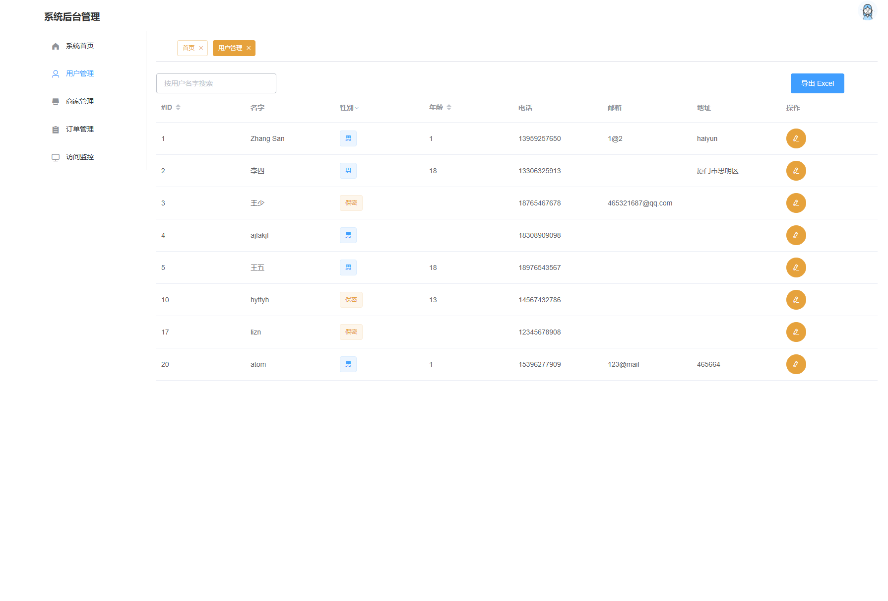

# 17-外卖点单系统

```
如需完整代码请+v：Ai1763591756
```


### 系统功能

1. 商家和用户可以注册和登录

2. 可以修改个人信息

3. 管理员可对用户信息进行查看和管理；管理员对商家进行查看和管理

4. 商家录入菜单（餐点名称，餐点类型，库存数量，餐点单价，餐点图片）

5. 菜单的修改、删除

6. 根据类型或关键字筛选相关菜单

7. 用户选择餐点加入购物车

8. 购物车内餐点数量的修改、删除

9. 用户订单提交

10. 商家确认点单，库存数量修改

11. 历史订单查询，根据用户号或者用户信息查询用户历史订单

12. 餐点欢迎度分析，统计各类餐点的选购频率，按频率排序项目地址：

[TOC]

## 整体效果


## 技术栈

### 后端技术栈

1. SpringBoot

2. SpringShiro

3. JdbcTemplate

4. MySQL

### 前端技术栈

1. Vue+Vuex+Vue-router

2. ElementUI

3. axios

## 部署

1. 数据库脚本放在数据库文件夹中，在MySQL中`create database takeout`后执行各sql脚本

2. 数据库配置在backend项目的resources目录下的application.yml文件中；由于本项目使用了阿里云的短信服务，所以要在backend项目下的`\common\util\SmsTool`里替换成自己的AK，如下图：

   

3. 在IntelliJ IDEA中运行backend项目

4. 服务器端已经部署完毕，现在进入frontend目录，在命令行中依次执行如下命令：

   ```
   # 安装依赖，下面命令不成功则使用淘宝镜像cnpm
   npm install
   # 在 localhost:8081 启动项目
   npm run dev
   ```

5. 此时访问`http://localhost:8081/`就可以访问我们的前端项目了，管理员界面和上述步骤一样，访问`http://localhost:8082/`即可

6. 如果想打包则运行下面的命令:

   ```
   npm run build
   ```

   该命令运行成功后，frontend目录下生成一个dist文件夹，将该文件夹中的两个文件static和index.html拷贝到backend项目中resources/static/目录下，则可以直接在IDEA中启动项目即可

## 文档

课程报告和PPT在doc文件夹下,项目开发过程的开发文档在doc文件夹下的开发文档文件夹内

> 都很水233

## 请求流程

下图展示本系统的请求流程，此思路模仿项目[FEBS-Vue](https://github.com/wuyouzhuguli/FEBS-Vue), 可惜没用到缓存：


### 系统展示页面：

#### 商家后台管理

   


前端：


系统的用例图：


系统类图：


